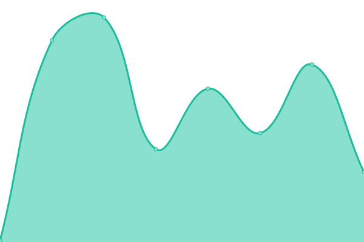

# [📈 Live Status](https://arkreen.github.io/upptime): <!--live status--> **🟧 Partial outage**

This repository contains the open-source uptime monitor and status page for [arkreen](https://arkreen.github.io/upptime), powered by [Upptime](https://github.com/upptime/upptime).

With [Upptime](https://upptime.js.org), you can get your own unlimited and free uptime monitor and status page, powered entirely by a GitHub repository. We use [Issues](https://github.com/arkreen/upptime/issues) as incident reports, [Actions](https://github.com/arkreen/upptime/actions) as uptime monitors, and [Pages](https://arkreen.github.io/upptime) for the status page.

<!--start: status pages-->
<!-- This summary is generated by Upptime (https://github.com/upptime/upptime) -->
<!-- Do not edit this manually, your changes will be overwritten -->
<!-- prettier-ignore -->
| URL | Status | History | Response Time | Uptime |
| --- | ------ | ------- | ------------- | ------ |
|  [Arkreen](https://arkreen.com) | 🟩 Up | [arkreen.yml](https://github.com/arkreen/upptime/commits/HEAD/history/arkreen.yml) | 

 113ms
     
 | 

<a href="https://up.aigc.it/history/arkreen">100.00%</a>
    

|  [Arkreen Test API net_getVersion](https://testapi.arkreen.com/v1) | 🟩 Up | [arkreen-test-api-net-get-version.yml](https://github.com/arkreen/upptime/commits/HEAD/history/arkreen-test-api-net-get-version.yml) | 

 874ms
     
 | 

<a href="https://up.aigc.it/history/arkreen-test-api-net-get-version">99.93%</a>
    

|  [Arkreen Test API net_getBlockList](https://testapi.arkreen.com/v1) | 🟩 Up | [arkreen-test-api-net-get-block-list.yml](https://github.com/arkreen/upptime/commits/HEAD/history/arkreen-test-api-net-get-block-list.yml) | 

 223ms
     
 | 

<a href="https://up.aigc.it/history/arkreen-test-api-net-get-block-list">99.93%</a>
    

|  [Arkreen Test API net_getAccountList](https://testapi.arkreen.com/v1) | 🟩 Up | [arkreen-test-api-net-get-account-list.yml](https://github.com/arkreen/upptime/commits/HEAD/history/arkreen-test-api-net-get-account-list.yml) | 

 230ms
     
 | 

<a href="https://up.aigc.it/history/arkreen-test-api-net-get-account-list">100.00%</a>
    

|  [Arkreen Test API net_getTransactionListByType](https://testapi.arkreen.com/v1) | 🟩 Up | [arkreen-test-api-net-get-transaction-list-by-type.yml](https://github.com/arkreen/upptime/commits/HEAD/history/arkreen-test-api-net-get-transaction-list-by-type.yml) | 

 468ms
     
 | 

<a href="https://up.aigc.it/history/arkreen-test-api-net-get-transaction-list-by-type">100.00%</a>
    

|  [Arkreen Test API net_getMinerList](https://testapi.arkreen.com/v1) | 🟩 Up | [arkreen-test-api-net-get-miner-list.yml](https://github.com/arkreen/upptime/commits/HEAD/history/arkreen-test-api-net-get-miner-list.yml) | 

 298ms
     
 | 

<a href="https://up.aigc.it/history/arkreen-test-api-net-get-miner-list">100.00%</a>
    

|  [Arkreen Test API net_getAccountByAddress](https://testapi.arkreen.com/v1) | 🟩 Up | [arkreen-test-api-net-get-account-by-address.yml](https://github.com/arkreen/upptime/commits/HEAD/history/arkreen-test-api-net-get-account-by-address.yml) | 

 211ms
     
 | 

<a href="https://up.aigc.it/history/arkreen-test-api-net-get-account-by-address">100.00%</a>
    

|  [Arkreen Test API net_getMinerListByOwner](https://testapi.arkreen.com/v1) | 🟩 Up | [arkreen-test-api-net-get-miner-list-by-owner.yml](https://github.com/arkreen/upptime/commits/HEAD/history/arkreen-test-api-net-get-miner-list-by-owner.yml) | 

 210ms
     
 | 

<a href="https://up.aigc.it/history/arkreen-test-api-net-get-miner-list-by-owner">100.00%</a>
    

|  [Arkreen Test API net_getTransactionByHash](https://testapi.arkreen.com/v1) | 🟩 Up | [arkreen-test-api-net-get-transaction-by-hash.yml](https://github.com/arkreen/upptime/commits/HEAD/history/arkreen-test-api-net-get-transaction-by-hash.yml) | 

 209ms
     
 | 

<a href="https://up.aigc.it/history/arkreen-test-api-net-get-transaction-by-hash">100.00%</a>
    

|  [Arkreen Test API net_getBlockByHeight](https://testapi.arkreen.com/v1) | 🟩 Up | [arkreen-test-api-net-get-block-by-height.yml](https://github.com/arkreen/upptime/commits/HEAD/history/arkreen-test-api-net-get-block-by-height.yml) | 

 210ms
     
 | 

<a href="https://up.aigc.it/history/arkreen-test-api-net-get-block-by-height">100.00%</a>
    

|  [Arkreen Test API net_getBlockTransactionsByHeight](https://testapi.arkreen.com/v1) | 🟩 Up | [arkreen-test-api-net-get-block-transactions-by-height.yml](https://github.com/arkreen/upptime/commits/HEAD/history/arkreen-test-api-net-get-block-transactions-by-height.yml) | 

 383ms
     
 | 

<a href="https://up.aigc.it/history/arkreen-test-api-net-get-block-transactions-by-height">100.00%</a>
    

|  [Arkreen Test API net_statMinerDailyReward](https://testapi.arkreen.com/v1) | 🟥 Down | [arkreen-test-api-net-stat-miner-daily-reward.yml](https://github.com/arkreen/upptime/commits/HEAD/history/arkreen-test-api-net-stat-miner-daily-reward.yml) | 

 209ms
     
 | 

<a href="https://up.aigc.it/history/arkreen-test-api-net-stat-miner-daily-reward">0.00%</a>
    

|  [Arkreen Test API net_statMinerGreenEnergyTrend](https://testapi.arkreen.com/v1) | 🟥 Down | [arkreen-test-api-net-stat-miner-green-energy-trend.yml](https://github.com/arkreen/upptime/commits/HEAD/history/arkreen-test-api-net-stat-miner-green-energy-trend.yml) | 

 209ms
     
 | 

<a href="https://up.aigc.it/history/arkreen-test-api-net-stat-miner-green-energy-trend">0.00%</a>
    

|  [Arkreen Test API net_search](https://testapi.arkreen.com/v1) | 🟥 Down | [arkreen-test-api-net-search.yml](https://github.com/arkreen/upptime/commits/HEAD/history/arkreen-test-api-net-search.yml) | 

 209ms
     
 | 

<a href="https://up.aigc.it/history/arkreen-test-api-net-search">0.00%</a>
    

|  [Arkreen Test API net_getMinerTransactionListByType](https://testapi.arkreen.com/v1) | 🟩 Up | [arkreen-test-api-net-get-miner-transaction-list-by-type.yml](https://github.com/arkreen/upptime/commits/HEAD/history/arkreen-test-api-net-get-miner-transaction-list-by-type.yml) | 

 219ms
     
 | 

<a href="https://up.aigc.it/history/arkreen-test-api-net-get-miner-transaction-list-by-type">100.00%</a>
    

<!--end: status pages-->

[**Visit our status website →**](https://arkreen.github.io/upptime)

## 📄 License

- Powered by: [Upptime](https://github.com/upptime/upptime)
- Code: [MIT](./LICENSE) © [arkreen](https://arkreen.github.io/upptime)
- Data in the `./history` directory: [Open Database License](https://opendatacommons.org/licenses/odbl/1-0/)
